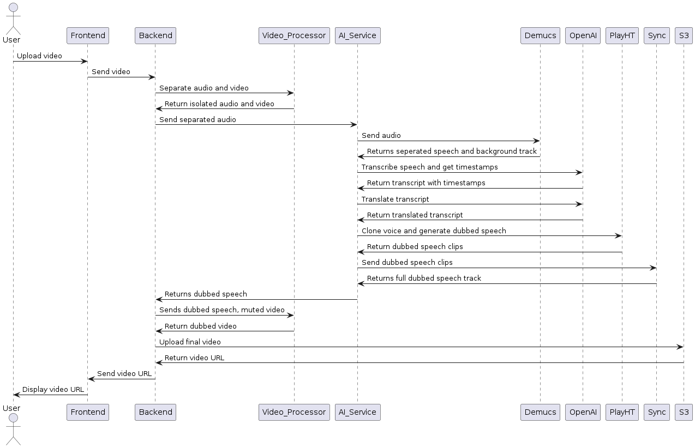

# DubTok
DubTok, an application that automatically dubs your videos into any language. Simply upload your video, choose your desired language, and our solution delivers high-quality, seamlessly dubbed content!

# Demo

Try out Dubtok online: https://dubtok-forked.vercel.app/

## Folder Structure
Our project is broken up into the following folders
```
.
├── 📂 ai/              # Contains code related to ai
├── 📂 backend/         # Contains code related to the backend
├── 📂 frontend/        # Contains code related to the frontend
├── 📂 sample_videos/   # Sample videos for testing the application
├── 📂 uploads/         # Folder used for storing uploaded files
├── ⚙ .gitignore
└── 📔 README.md
```

We split the AI, backend, and the frontend each into their own directories. We also uploaded some sample videos which can be used for testing the application.

## Sequence diagram
Below is a sequence diagram detailing our application operations.




## Setting up of environment variables
Before running the application, you would need to setup the environment variables containing the API keys to the services used in our project. You would need an OpenAI API key and a PlayHT API key. To setup the environment variables, create a .env file in the root folder.
```
.
├── 📂 ai/              
├── 📂 backend/         
├── 📂 frontend/        
├── 📂 sample_videos/   
├── 📂 uploads/         
├── ⚙ .gitignore
├── 📔 README.md
└── ⚙ .env             # Create the .env file here!
``` 

Inside the .env file, include the following parameters.
```
OPENAI_API_KEY=<INSERT YOUR OPENAI API KEY HERE!>
PLAYHT_USERID=<INSERT YOUR PLAYHT USERID HERE!>
PLAYHT_APIKEY=<INSERT YOUR PLAYHT API KEY HERE!>
```

You would also need to configure AWS and setup a S3 bucket to use our application. Our application uses the bucket name "tiktoktechjam-2024". Create an S3 bucket with the same name, and make sure `Block public and cross-account access to buckets and objects through any public bucket or access point policies` is unchecked. Create a bucket policy allowing public read requests such as the following:
```
{
    "Version": "2012-10-17",
    "Statement": [
        {
            "Sid": "PublicReadGetObject",
            "Effect": "Allow",
            "Principal": "*",
            "Action": "s3:GetObject",
            "Resource": "arn:aws:s3:::tiktoktechjam-2024/*"
        }
    ]
}
```

You will then need to configure your AWS credentials on your local machine to access the bucket. You can follow [this](https://docs.aws.amazon.com/cli/latest/userguide/cli-chap-configure.html) tutorial to setup your AWS credentials. 

# Frontend
Our frontend contains the following files
```
.
└── 📂 frontend/
    ├── 📂 public/
    ├── 📂 src/app/
    │   ├── 📂 components/     # Contains the React components
    │   ├── 📂 config/  
    │   ├── 📂 demo/
    │   ├── 📂 test/
    │   ├── 📂 utils/
    │   ├── 🔽 favicon.ico
    │   ├── 🎨 globals.css
    │   ├── 🗒 layout.js
    │   ├── 🗒 page.js
    │   └── ...
    ├── 🗒 tailwind.config.js   # Configuration file for Tailwind CSS
    └── ...
```

To run the frontend, navigate into the frontend folder and install the required dependencies
```
npm i
```
You will require Node.js to install these dependencies.

After installing the required dependencies, run the frontend with
``` 
npm start
```

# Backend
Our backend contains the following files
```
.
└── 📂 backend/
    ├── 📂 db/
    │   ├── 🐍 __init__.py
    │   ├── 🐍 crud.py      # Contains the CRUD operations for the database
    │   ├── 🐍 database.py  # Connects to the SQLite database
    │   ├── 🐍 models.py    # Contains the ORM code
    │   └── 🐍 schemas.py   # Schemas to validate the ORM data structures
    ├── 📂 services/
    │   └── 🐍 video_audio_processor.py     # Splits the audio from the video
    ├── 📂 tests/
    │   └── 🐍 api_test.py  # Contains test code for the API endpoints
    ├── 🐍 main.py          # Main code to run the backend server
    └── 📝 requirements.txt
```

To run the backend server, navigate into the backend folder and install the required dependencies in requirements.py. You can do so in by creating a virtual environment first and installing the requirements with 
```
pip install -r requirements.txt
```

After installing, simply run the server with the following command
```
fastapi dev main.py
```
This would run start the development server

# AI
Our AI folder contains the following files
```
.
└── 📂 ai/
    ├── 📂 chunks/                  # Folder used for storing temporary files 
    └── 📂 output_audio/            # Folder used for storing temporary output files
        ├── 🐍 __init__.py
        ├── 🐍 ai_service.py        
        ├── 🐍 del_voice_clone.py
        ├── 🐍 fix_tts.py
        ├── 🐍 newtest.py
        ├── 🐍 openai_setup.py      # Loads the OpenAI API key
        ├── 🐍 preprocess_audio.py
        ├── 📝 requirements.txt
        ├── 🐍 stitch.py            
        ├── 🐍 sync_translation.py
        ├── 🐍 transcribe.py        # Transcribe a given audio file
        ├── 🐍 translate.py         # Translates the transcript to the target language
        ├── 🐍 translated_chunks.py 
        ├── 🐍 tts.py
        └── 🐍 voice_clone.py
```

The AI folder contains the pipeline for the audio dubbing process. Our audio dubbing pipeline is organized into several steps:

1. **Audio and Video Separation:** Using FFMpeg, the video is isolated from the audio file. 

2. **Audio Separation:** Utilizing Demucs, the service separates audio into vocals and non-vocals, crucial for creating a clear voice clone and assembling dubbed audio.

3. **Transcription and Timestamping:** OpenAI's API transcribes speech and provides word timestamps, essential for subsequent translation and voice cloning.

4. **Translation:** The transcribed text is translated into the target language using OpenAI's API, preparing it for voice cloning.

5. **Voice Cloning:** PlayHT's API clones the speaker's voice using the isolated vocal track, ensuring authenticity in the dubbed audio.

6. **Voice Dubbing:** Using translated transcripts and cloned voice, PlayHT generates sentence-level voice dubs, maintaining narrative coherence.

7. **Timing Adjustment:** Each dubbed sentence is meticulously adjusted to match the original's timing without altering pitch, ensuring synchronization with the video.

8. **Assembly:** Dubbed sentences are stitched together to form the complete dubbed audio, mixed with non-vocal audio to produce the final dubbed video soundtrack.

9. **Final Output:** The dubbed audio track is reassembled with the isolated video file, resulting in the completed dubbed video ready for distribution.
